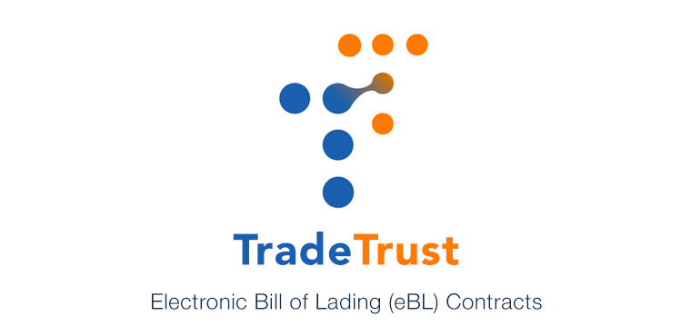

<h1 align="center">
  <p align="center">Token Registry</p>
  <a href="https://tradetrust.io"></a>
</h1>

<p align="center">
    <a href="https://tradetrust.io">TradeTrust</a> Electronic Title Records (eBL) &amp; Obligation Titles (BoE)
</p>

<p align="center"> 
  <a href="https://github.com/tradetrust/token-registry/tree/master" alt="Release"></a>
  <a href="https://codecov.io/gh/Open-Attestation/token-registry" alt="Code Coverage"></a>
  <a href="https://www.npmjs.com/package/@tradetrust-tt/token-registry" alt="NPM"></a>
  
</p>

This repository provides on-chain title custody for TradeTrust transferable records. It includes:

- **Electronic Bill of Lading (eBL) / Electronic Title Record (ETR):** `TradeTrustToken` + `TitleEscrow` (+ `TitleEscrowFactory`)
- **Bill of Exchange (BoE) / Obligation titles:** `TrustVCToken` + `ObligationEscrow` (+ `ObligationEscrowFactory`)

The [Token Registry](https://github.com/TradeTrust/token-registry) repository contains both the smart contract code (in `/contracts`) and the Node package for using this library (in `/src`).

| Use case | Token registry | Escrow | Factory |
| -------- | -------------- | ------ | ------- |
| eBL / ETR | `TradeTrustToken` | `TitleEscrow` | `TitleEscrowFactory` |
| BoE / Obligation | `TrustVCToken` | `ObligationEscrow` | `ObligationEscrowFactory` |

Both paths use a Soulbound Token (SBT) minted to a deterministic escrow clone that holds beneficiary/holder ownership. Obligation escrows add an on-chain status lifecycle (`Issued` → `Accepted` / `Rejected` / `Discharged`) on top of the same custody model.

## Table of Contents

- [Installation](#installation)
- [Usage](#usage)
  - [TradeTrustToken](#tradetrusttoken)
    - [Connect to existing token registry](#connect-to-existing-token-registry)
    - [Issuing a Document](#issuing-a-document)
    - [Restoring a Document](#restoring-a-document)
    - [Accept/Burn a Document](#acceptburn-a-document)
  - [Title Escrow](#title-escrow)
    - [Connect to Title Escrow](#connect-to-title-escrow)
    - [Transfer of Beneficiary/Holder](#transfer-of-beneficiaryholder)
    - [Reject Transfers of Beneficiary/Holder](#reject-transfers-of-beneficiaryholder)
    - [Return ETR Document to Issuer](#return-etr-document-to-issuer)
    - [Accessing the Current Owners](#accessing-the-current-owners)
  - [TrustVCToken](#trustvctoken)
    - [Connect to existing obligation registry](#connect-to-existing-obligation-registry)
    - [Issuing an Obligation Title](#issuing-an-obligation-title)
    - [Restoring / Burning an Obligation Title](#restoring--burning-an-obligation-title)
  - [Obligation Escrow](#obligation-escrow)
    - [Connect to Obligation Escrow](#connect-to-obligation-escrow)
    - [Status Lifecycle](#status-lifecycle)
    - [Transfer of Beneficiary/Holder](#transfer-of-beneficiaryholder-1)
    - [Reject Transfers of Beneficiary/Holder](#reject-transfers-of-beneficiaryholder-1)
    - [Return Obligation Title to Issuer](#return-obligation-title-to-issuer)
    - [Accessing Status and Owners](#accessing-status-and-owners)
  - [Provider \& Signer](#provider--signer)
  - [Roles and Access](#roles-and-access)
    - [Grant a role to a user](#grant-a-role-to-a-user)
    - [Revoke a role from a user](#revoke-a-role-from-a-user)
    - [Setting a role admin (Advanced Usage)](#setting-a-role-admin-advanced-usage)
- [Deployment](#deployment)
  - [Quick Start](#quick-start)
  - [Advanced Usage](#advanced-usage)
    - [Token Contract](#token-contract)
      - [Using an existing Title Escrow Factory](#using-an-existing-title-escrow-factory)
    - [Title Escrow Factory](#title-escrow-factory)
      - [Deploy a new Title Escrow Factory](#deploy-a-new-title-escrow-factory)
    - [Obligation Registry (TrustVCToken)](#obligation-registry-trustvctoken)
  - [Verification](#verification)
  - [Network Configuration](#network-configuration)
- [Configuration](#configuration)
- [Development](#development)
  - [Scripts](#scripts)
- [Subgraph](#subgraph)
- [Notes](#notes)

# Installation

```sh
npm install --save @tradetrust-tt/token-registry
```

---

# Usage

To use the package, you will need to provide your own
Web3 [provider](https://docs.ethers.io/v5/api/providers/api-providers/)
or [signer](https://docs.ethers.io/v5/api/signer/#Wallet) (if you are writing to the blockchain).
This package exposes the [Typechain (Ethers)](https://github.com/dethcrypto/TypeChain/tree/master/packages/target-ethers-v6) bindings for the contracts.

## TradeTrustToken

The `TradeTrustToken` is a Soulbound Token (SBT) tied to the Title Escrow. The SBT implementation is loosely based on OpenZeppelin's implementation of the [ERC721](http://erc721.org/) standard.
An SBT is used in this case because the token, while can be transferred to the registry, is largely restricted to its designated Title Escrow contracts.
See issue [#108](https://github.com/Open-Attestation/token-registry/issues/108) for more details.

### Connect to existing token registry

```ts
import { TradeTrustToken__factory } from "@tradetrust-tt/token-registry/contracts";

const connectedRegistry = TradeTrustToken__factory.connect(tokenRegistryAddress, signer);
```

### Issuing a Document

```ts
await connectedRegistry.mint(beneficiaryAddress, holderAddress, tokenId, remarks);
```

### Restoring a Document

```ts
await connectedRegistry.restore(tokenId, remarks);
```

### Accept/Burn a Document

```ts
await connectedRegistry.burn(tokenId, remarks);
```

## Title Escrow

The Title Escrow contract is used to manage and represent the ownership of a token between a **`beneficiary`** and **`holder`**.
During minting, the Token Registry will create and assign a Title Escrow as the owner of that token.
The actual owners will use the Title Escrow contract to perform their ownership operations.

> [!IMPORTANT]
> A new `remark` field has been **introduced** for all contract operations.
> 
> The `remark` field is optional and can be left empty by providing an empty string `"0x"`.
> Please note that any value in the `remark` field is limited to **120** characters, and encryption is **recommended**.
>
> Please refer to the sample encryption implementation [here]().

### Connect to Title Escrow

```ts
import { TitleEscrow__factory } from "@tradetrust-tt/token-registry/contracts";

const connectedEscrow = TitleEscrow__factory.connect(existingTitleEscrowAddress, signer);
```

### Transfer of Beneficiary/Holder

Transferring of **`beneficiary`** and **`holder`** within the Title Escrow relies on the following methods:

```solidity
function transferBeneficiary(address nominee, bytes calldata remark) external;

function transferHolder(address newHolder, bytes calldata remark) external;

function transferOwners(address nominee, address newHolder, bytes calldata remark) external;

function nominate(address nominee, bytes calldata remark) external;
```

> [!NOTE]
> The `transferBeneficiary` transfers only the beneficiary and `transferHolder` transfers only the holder.
> To transfer both beneficiary and holder in a single transaction, use `transferOwners`.
>
> In the event where the **`holder`** is different from the **`beneficiary`**, the transfer of beneficiary will require a nomination done through the `nominate` method.

### Reject Transfers of Beneficiary/Holder

Rejection of transfers for any wrongful transactions.

```solidity
function rejectTransferBeneficiary(bytes calldata _remark) external;

function rejectTransferHolder(bytes calldata _remark) external;

function rejectTransferOwners(bytes calldata _remark) external;
```

> [!IMPORTANT]
> Rejection must occur as the very next action after being appointed as **`beneficiary`** and/or **`holder`**. If any transactions occur by the new appointee, it will be considered as an implicit acceptance of appointment.
>
> There are separate methods to reject a **`beneficiary`** (`rejectTransferBeneficiary`) and a **`holder`** (`rejectTransferHolder`). However, if you are both, you must use `rejectTransferOwners`, as the other two methods will not work in this case.

### Return ETR Document to Issuer

Use the `returnToIssuer` method in the Title Escrow.

```solidity
function returnToIssuer(bytes calldata remark) external;
```

### Accessing the Current Owners

The addresses of the current owners can be retrieved from the `beneficiary`, `holder` and `nominee` methods.

Example:

```ts
const currentBeneficiary = await connectedEscrow.beneficiary();

const currentHolder = await connectedEscrow.holder();

const nominatedBeneficiary = await connectedEscrow.nominee();
```

## TrustVCToken

`TrustVCToken` is the SBT registry for **obligation titles** (for example Bill of Exchange). It follows the same mint / restore / burn shape as `TradeTrustToken`, but uses `ObligationEscrowFactory` instead of `TitleEscrowFactory`. Status lifecycle (`accept` / `reject` / `discharge`) lives on the escrow, not on the token.

> [!NOTE]
> `TrustVCToken` still exposes `titleEscrowFactory()` for compatibility with shared base contracts; that address is the obligation escrow factory. Prefer `obligationEscrowFactory()` when working with BoE titles.

### Connect to existing obligation registry

```ts
import { TrustVCToken__factory } from "@tradetrust-tt/token-registry/contracts";

const connectedObligationRegistry = TrustVCToken__factory.connect(obligationRegistryAddress, signer);
```

### Issuing an Obligation Title

```ts
await connectedObligationRegistry.mint(beneficiaryAddress, holderAddress, tokenId, remarks);
```

Minting creates (or reuses) a deterministic `ObligationEscrow` clone and transfers the SBT into that escrow. On first receipt, the escrow sets beneficiary/holder and status to `Issued`.

### Restoring / Burning an Obligation Title

```ts
await connectedObligationRegistry.restore(tokenId, remarks);
await connectedObligationRegistry.burn(tokenId, remarks);
```

> [!NOTE]
> Reject and discharge on `ObligationEscrow` call `burnFromEscrow` on the registry (escrow-only). Issuer-side `burn` / `restore` follow the same registry roles as `TradeTrustToken`.

## Obligation Escrow

`ObligationEscrow` manages custody of an obligation title between a **`beneficiary`** and **`holder`**, and tracks status through the obligation lifecycle.

During minting, `TrustVCToken` creates and assigns an `ObligationEscrow` as the owner of that token — the same pattern as `TitleEscrow` for eBL.

> [!IMPORTANT]
> A `remark` field is used for contract operations (optional; pass `"0x"` when empty). Remark length is limited to **120** characters; encryption is recommended.

### Connect to Obligation Escrow

```ts
import { ObligationEscrow__factory, ObligationEscrowFactory__factory } from "@tradetrust-tt/token-registry/contracts";
import { utils } from "@tradetrust-tt/token-registry";

// From a known escrow address
const connectedObligationEscrow = ObligationEscrow__factory.connect(obligationEscrowAddress, signer);

// Or resolve the deterministic address from the factory
const factoryAddress = await connectedObligationRegistry.obligationEscrowFactory();
const factory = ObligationEscrowFactory__factory.connect(factoryAddress, signer);
const escrowAddress = await factory.getEscrowAddress(obligationRegistryAddress, tokenId);

// Off-chain prediction (same CREATE2 scheme as the factory)
const implementationAddress = await factory.implementation();
const predicted = utils.computeObligationEscrowAddress({
  implementationAddress,
  factoryAddress,
  registryAddress: obligationRegistryAddress,
  tokenId,
});
```

### Status Lifecycle

```solidity
enum Status { Issued, Accepted, Rejected, Discharged }

function status() external view returns (Status);
function isRegistered() external view returns (bool);

function accept(bytes calldata remark) external;    // holder, from Issued → Accepted
function reject(bytes calldata remark) external;    // holder, from Issued → Rejected (terminates + burns)
function discharge(bytes calldata remark) external; // beneficiary, from Accepted → Discharged (terminates + burns)
```

| Action | Caller | From | To | Effect |
| ------ | ------ | ---- | -- | ------ |
| `accept` | holder | `Issued` | `Accepted` | Title remains active |
| `reject` | holder | `Issued` | `Rejected` | Terminates escrow and burns token |
| `discharge` | beneficiary | `Accepted` | `Discharged` | Terminates escrow and burns token |

### Transfer of Beneficiary/Holder

Transfer APIs match `TitleEscrow`:

```solidity
function transferBeneficiary(address nominee, bytes calldata remark) external;
function transferHolder(address newHolder, bytes calldata remark) external;
function transferOwners(address nominee, address newHolder, bytes calldata remark) external;
function nominate(address nominee, bytes calldata remark) external;
```

### Reject Transfers of Beneficiary/Holder

```solidity
function rejectTransferBeneficiary(bytes calldata _remark) external;
function rejectTransferHolder(bytes calldata _remark) external;
function rejectTransferOwners(bytes calldata _remark) external;
```

Rejection rules are the same as Title Escrow: reject as the next action after appointment, and use `rejectTransferOwners` when you are both beneficiary and holder.

### Return Obligation Title to Issuer

```solidity
function returnToIssuer(bytes calldata remark) external;
```

Requires both beneficiary and holder (when dual roles apply). Sets `terminationReason` to `ReturnToIssuer` after shred by the registry.

### Accessing Status and Owners

```ts
const currentStatus = await connectedObligationEscrow.status();
const registered = await connectedObligationEscrow.isRegistered();
const reason = await connectedObligationEscrow.terminationReason();

const currentBeneficiary = await connectedObligationEscrow.beneficiary();
const currentHolder = await connectedObligationEscrow.holder();
const nominatedBeneficiary = await connectedObligationEscrow.nominee();
```

## Provider & Signer

Different ways to get provider or signer:

```ts
import { Wallet, providers, getDefaultProvider } from "ethers";

// Providers
const mainnetProvider = getDefaultProvider();
const metamaskProvider = new providers.Web3Provider(web3.currentProvider); // Will change network automatically

// Signer
const signerFromPrivateKey = new Wallet("YOUR-PRIVATE-KEY-HERE", provider);
const signerFromEncryptedJson = Wallet.fromEncryptedJson(json, password);
signerFromEncryptedJson.connect(provider);

const signerFromMnemonic = Wallet.fromMnemonic("MNEMONIC-HERE");
signerFromMnemonic.connect(provider);
```

## Roles and Access

Roles are useful for granting users to access certain functions only. Currently, here are the designated roles meant for the different key operations.

> [!IMPORTANT]
> Role management applies to the **token registries** (`TradeTrustToken` and `TrustVCToken`), not to the escrows.
> `TitleEscrow` and `ObligationEscrow` control access via **beneficiary** / **holder** only.

| Role           | Access                                     |
| -------------- | ------------------------------------------ |
| `DefaultAdmin` | Able to perform all operations             |
| `MinterRole`   | Able to mint new tokens                    |
| `AccepterRole` | Able to accept a token returned to issuer  |
| `RestorerRole` | Able to restore a token returned to issuer |

`TrustVCToken` inherits the same `RegistryAccess` roles as `TradeTrustToken`. Use `grantRole` / `revokeRole` / `setRoleAdmin` on either registry the same way.

A trusted user can be granted multiple roles by the admin user to perform different operations.
The following functions can be called on the token contract by the admin user to grant and revoke roles to and from users.

### Grant a role to a user

```ts
import { constants } from "@tradetrust-tt/token-registry";

await connectedRegistry.grantRole(constants.roleHash.MinterRole, accountAddress);
```

> [!IMPORTANT]
> Can only be called by **default admin** or **role admin**.

### Revoke a role from a user

```ts
import { constants } from "@tradetrust-tt/token-registry";

await connectedRegistry.revokeRole(constants.roleHash.AccepterRole, accountAddress);
```

> [!IMPORTANT]
> Can only be called by **default admin** or **role admin**.

### Setting a role admin (Advanced Usage)

The standard setup does not add the role-admin roles so that users don't deploy (and, hence, pay the gas for) more than what they need.
If you need a more complex setup, you can add the admin roles to the designated roles.

```ts
import { constants } from "@tradetrust-tt/token-registry";
const { roleHash } = constants;

await connectedRegistry.setRoleAdmin(roleHash.MinterRole, roleHash.MinterAdminRole);
await connectedRegistry.setRoleAdmin(roleHash.RestorerRole, roleHash.RestorerAdminRole);
await connectedRegistry.setRoleAdmin(roleHash.AccepterRole, roleHash.AccepterAdminRole);
```

> [!IMPORTANT]
> Can only be called by **default admin**.

# Deployment

Hardhat is used to manage the contract development environment and deployment. This repository provides a couple of
Hardhat tasks to simplify the deployment process.

Starting from v4, we have included an easy and cost-effective way to deploy the contracts while also keeping options available for advanced users to setup the contracts their preferred way.

> [!TIP]
> 💡 Please ensure that you have setup your configuration file before deployment.
>
> See [Configuration](#configuration) section for more details. The deployer (configured in your `.env` file) will be made the default admin.

## Quick Start

For users who want to quickly deploy their contracts without too much hassle, you’ll only have to supply the name and symbol of your token to the command, and you’re ready to roll!

```
npx hardhat deploy:token --network stability --name "The Great Shipping Co." --symbol GSC
```

👆 This is the easiest and most cost-effective method to deploy. The deployed contract will inherit all the standard functionality from our on-chain contracts. This helps to save deployment costs and make the process more convenient for users and integrators.

> [!TIP]
> 💡 Remember to supply the `--network` argument with the name of the network you wish to deploy on.
>
> See [Network Configuration](#network-configuration) section for more info on the list of network names.

## Advanced Usage

For experienced users who would like to have more control over their setup (or have extra 💰 to spend 💸), we have provided a few other options and commands.
However, you should be aware that, depending on what you’re doing, the gas costs could be higher than the method described in [Quick Start](#quick-start).
You should already know what you are doing when using any of these options.

### Token Contract

Deploys the token contract.

```
user@NMacBook-Pro token-registry % npx hardhat deploy:token --help

Usage: hardhat [GLOBAL OPTIONS] deploy:token --factory <STRING> --name <STRING> [--standalone] --symbol <STRING> [--verify]

OPTIONS:

  --factory   	Address of Title Escrow factory (Optional)
  --name      	Name of the token
  --standalone	Deploy as standalone token contract
  --symbol    	Symbol of token
  --verify    	Verify on Etherscan

deploy:token: Deploys the TradeTrust token
```

> [!TIP]
> 💡 Note that the `--factory` argument is optional. When not provided, the task will use the default Title Escrow Factory.
> You can also reuse a Title Escrow factory that you have previously deployed by passing its address to the `--factory` argument.

#### Using an existing Title Escrow Factory

- To use an existing version of Title Escrow factory, you can supply its address to the `—-factory` argument.

- To use your own version of Title Escrow factory, you need to supply its address to the `--factory` with the `--standalone` flag.

```
npx hardhat deploy:token --network polygon --name "The Great Shipping Co." --symbol GSC --factory 0xfac70
```

👆 This will deploy a "cheap" token contract with the name _The Great Shipping Co._ under the symbol _GSC_ on the _Polygon Mainnet_
network using an existing Title Escrow factory at `0xfac70`.

### Title Escrow Factory

Deploys the Title Escrow factory.

```
user@NMacBook-Pro token-registry % npx hardhat deploy:token --help

Usage: hardhat [GLOBAL OPTIONS] deploy:factory [--verify]

OPTIONS:

  --verify	Verify on Etherscan

deploy:factory: Deploys a new Title Escrow factory
```

#### Deploy a new Title Escrow Factory

If you want to deploy your own modified version or simply want to have your own copy of the Title Escrow factory, you can use this command:

```
npx hardhat deploy:factory --network amoy
```

👆 This will deploy a new Title Escrow factory on the _Amoyy_ network without verifying the contract.
To verify the contract, pass in the `--verify` flag.

### Obligation Registry (TrustVCToken)

Hardhat tasks `deploy:token` / `deploy:factory` currently target the eBL stack (`TradeTrustToken` / `TitleEscrowFactory`).

For BoE, deploy `ObligationEscrowFactory` first, then `TrustVCToken` with that factory address:

```ts
import { ethers } from "hardhat";

const escrowFactory = await (await ethers.getContractFactory("ObligationEscrowFactory")).deploy();
await escrowFactory.waitForDeployment();

const token = await (
  await ethers.getContractFactory("TrustVCToken")
).deploy("My Obligation Registry", "MOR", await escrowFactory.getAddress());
await token.waitForDeployment();
```

The deployer becomes the default admin (same role model as `TradeTrustToken`).

## Verification

When verifying the contracts through either the Hardhat's verify plugin or passing the `--verify` flag to the deployment
tasks (which internally uses the same plugin), you will need to include your correct API key, depending on the network, in your `.env` configuration. See [Configuration](#configuration) section for more info.

- For Ethereum, set `ETHERSCAN_API_KEY`.
- For Polygon, set `POLYGONSCAN_API_KEY`.
- For Astron, set `ASTRON_API_KEY`.
- For Astrontestnet, set `ASTRON_TESTNET_API_KEY`.

## Network Configuration

Here's a list of network names currently pre-configured:

- `mainnet` (Ethereum)
- `sepolia`
- `polygon` (Polygon Mainnet)
- `amoy` (Polygon Amoy)
- `xdc` (XDC Network Mainnet)
- `xdcapothem` (XDC Apothem TestNet)
- `stabilitytestnet` (Stability TestNet)
- `stability` (Stability Global Trust Network)
- `astron` (astron Network MainNet)
- `astrontestnet` (astron Network TestNet)

> [!TIP]
> 💡 You can configure existing and add other networks you wish to deploy to in the `hardhat.config.ts` file.

# Configuration

Create a `.env` file and add your own keys into it. You can rename from the sample file `.env.sample` or copy the
following into a new file:

```
# Infura
INFURA_APP_ID=

# API Keys
ETHERSCAN_API_KEY=
POLYGONSCAN_API_KEY=
COINMARKETCAP_API_KEY=
STABILITY_API_KEY=
ASTRONSCAN_API_KEY=
ASTRON_TESTNET_API_KEY=

# Deployer Private Key
DEPLOYER_PK=

# Mnemonic words
MNEMONIC=
```

Only either the `DEPLOYER_PK` or `MNEMONIC` is needed.

# Development

This repository's development framework uses [HardHat](https://hardhat.org/getting-started/).

Tests are run using `npm run test`, more development tasks can be found in the package.json scripts.

## Scripts

```sh
npm install
npm test
npm run lint
npm run build

# See Deployment section for more info
npx hardhat deploy:token
npx hardhat deploy:factory
npx hardhat deploy:token:impl
```

# Subgraph

Check out our [Token Registry Subgraph](https://github.com/tradetrust/token-registry-subgraph) Github repository
for more information on using and deploying your own subgraphs for the Token Registry contracts.

# Notes

- The contracts have not gone through formal audits yet. Please use them at your own discretion.
